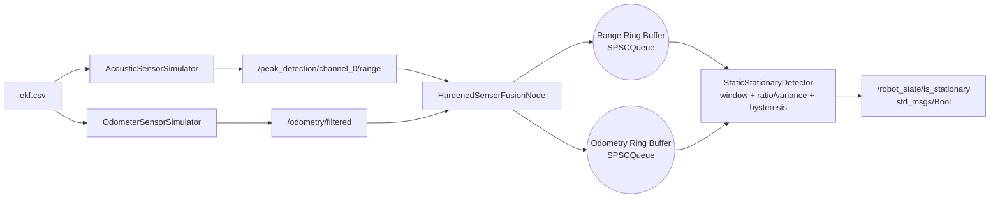
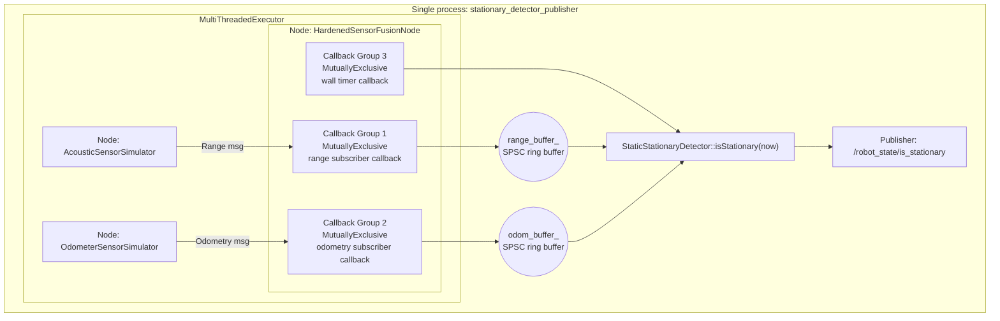

# ROS2 Sensor Fusion: Stationary vs Moving

## What this project does
This workspace simulates two sensor streams from a CSV log and fuses them to publish whether the robot is stationary.

- Output topic: `/robot_state/is_stationary` (`std_msgs/Bool`)
- `true` means stationary
- `false` means moving or uncertain (safe fallback)

Main package: `udemy_ros2_pkg`

## Runtime architecture (current)
The executable `stationary_detector_publisher` creates and runs three nodes in one process:

1. `AcousticSensorSimulator` (range stream)
2. `OdometerSensorSimulator` (odometry stream)
3. `HardenedSensorFusionNode` (fusion + decision publisher)

It uses one `rclcpp::executors::MultiThreadedExecutor` in the same process.

- Sensor simulator nodes run concurrently under the executor.
- Inside `HardenedSensorFusionNode`, three `MutuallyExclusive` callback groups split work into:
   - range subscriber callback
   - odometry subscriber callback
   - wall-timer fusion callback
- Range and odometry callbacks push timestamped samples into fixed-capacity SPSC ring buffers in `StaticStationaryDetector`.
- The wall timer reads the latest sliding window from both buffers and publishes `/robot_state/is_stationary`.

Key files:
- `udemy_ros2_pkg/src/stationary_detector_publisher.cpp`
- `udemy_ros2_pkg/src/range_publisher_demo.cpp`
- `udemy_ros2_pkg/src/odometer_publisher_demo.cpp`
- `udemy_ros2_pkg/include/udemy_ros2_pkg/static_stationary_detector.hpp`

## High-level data flow


## Thread and callback-group view


## Data source and published values
CSV file: `udemy_ros2_pkg/src/ekf.csv`

### Range stream
Published on `/peak_detection/channel_0/range` as `sensor_msgs::msg::Range`.

- `range = abs(pos_z)` from CSV
- Message header timestamp uses ROS time (`this->now()`)

### Odometry stream
Published on `/odometry/filtered` as `nav_msgs::msg::Odometry`.

- Position from CSV: `pos_x`, `pos_y`, `pos_z`
- Orientation from CSV Euler angles (`roll`, `pitch`, `yaw`) converted to quaternion
- Linear twist is computed numerically from position deltas over time:
  - `vx = dx/dt`, `vy = dy/dt`, `vz = dz/dt`

## Decision logic (current algorithm)
Implemented in `StaticStationaryDetector`.

At each fusion tick:
1. Define time window: `[now - window_duration_sec, now]`
2. Prune old samples from both queues
3. Compute odometry moving ratio in-window:
   - Count samples with `velocity >= velocity_threshold`
   - `moving_ratio = moving_count / valid_odom_count`
4. Compute in-window range variance
5. Apply ratio + variance with hysteresis and previous-state memory:
   - Enter-stationary requires stricter limits
   - Exit-stationary requires stronger moving evidence
   - Middle band keeps last state to reduce flicker

Safety behavior:
- No fresh odometry -> publish `false`
- Too few range samples (<3) -> publish `false`

## Why this design
- Asynchronous callbacks stay O(1): just push samples
- Heavy logic runs in deterministic timer callback
- Fixed-capacity SPSC queues avoid runtime allocations
- Sliding window gives noise robustness
- Hysteresis avoids rapid state toggling

## Parameters you should know
Declared in `HardenedSensorFusionNode`:

- `window_duration_sec`
- `velocity_threshold`
- `range_variance_threshold`
- `moving_ratio_threshold`
- `moving_ratio_hysteresis`
- `variance_hysteresis_ratio`
- `fusion_loop_rate_hz`
- `expected_odom_hz`
- `expected_range_hz`

Notes:
- The launch file may override these defaults.
- Current detector startup logs print active values at runtime.

## Build and run
From workspace root:

```bash
source /opt/ros/jazzy/setup.bash
colcon build --packages-select udemy_ros2_pkg sensors_fusion_test
source install/setup.bash
ros2 launch udemy_ros2_pkg sensors_fusion.launch.py
```

Inspect output:

```bash
ros2 topic echo /robot_state/is_stationary
```

## Testing
```bash
colcon test --packages-select sensors_fusion_test
colcon test-result --all --verbose
```

## Practical troubleshooting
- If output looks wrong, first ensure only one fusion launch is running.
- If you see repeated queue-full warnings, increase expected rates or window/buffer sizing.
- If state is always `false`, inspect logs for CSV open errors and verify both input topics publish.
